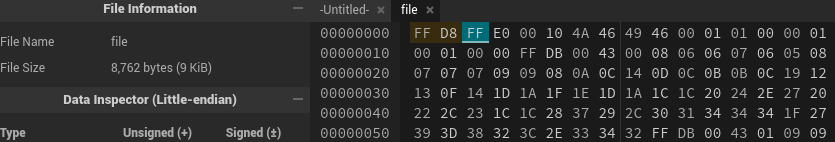
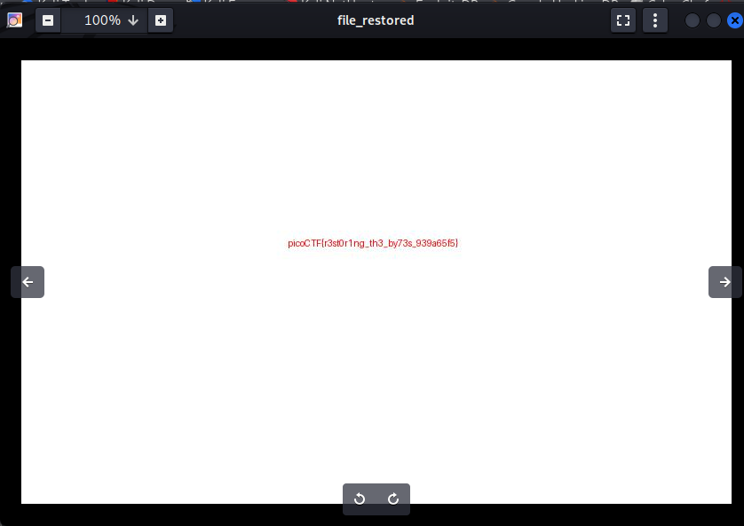

**Description:** This file seems broken... or is it? Maybe a couple of bytes could make all the difference. Can you figure out how to bring it back to life? Download the `file` here.

**Topic:** Forensic

First we need to download the image from the problem first.

```bash
wget https://challenge-files.picoctf.net/c_amiable_citadel/8646393bf40c0026e51065e57963b604edf0a9a73371e01d1af2865c050d3e68/file
```
First, i ran the default command for every problem 

```bash 
strings file | grep -oE "picoCTF{.*}"
```
The results returned nothing but blank space

Checked the type of file and its said:

```bash 
file file
```

```bash
└─$ file file
file: data
```

Next, i grabbed the metadata of the file to see any watermarks left within the file

```bash
exfiltool file
```
Noticed that it said: 

```txt
ExifTool Version Number         : 13.36
File Name                       : file
Directory                       : .
File Size                       : 8.8 kB
File Modification Date/Time     : 2025:09:25 13:14:07-07:00
File Access Date/Time           : 2026:01:08 10:36:31-08:00
File Inode Change Date/Time     : 2026:01:08 10:36:28-08:00
File Permissions                : -rw-rw-r--
**Error                           : Unknown file type**
```
The file was in the wrong type and corrupted 

Check the heading again

```bash 
string file | more 
```

And it have the format of `JPEG` image file 

```bash 
**JFIF**
 $.' ",#
(7),01444
'9=82<.342
!22222222222222222222222222222222222222222222222222
$3br
%&'()*456789:CDEFGHIJSTUVWXYZcdefghijstuvwxyz
        #3R
&'()*56789:CDEFGHIJSTUVWXYZcdefghijstuvwxyz
<Sqaa{w&
neS=
...
```
I googled the format hex of the JPEG image file and it should be started with `FF D8` so i ran the `hexdump` command to check the hex format of the current file

```bash 
# or you can use xxd
hexdump file 
```
And it returned as expected, the header was being modify the two first 2 value

```bash 
└─$ hexdump file | more -n 1
0000000 785c e0ff 1000 464a 4649 0100 0001 0100
```
Modifyed with `subl` or website `https://hexed.it/`

 

Check the format again 
```bash
cp file file_restored & file file_restored
```
And we had: 

```bash 
file_restored: JPEG image data, JFIF standard 1.01, aspect ratio, density 1x1, segment length 16, baseline,precision 8, 800x500, components 3
```
Opened that up and we have:

```bash 
eog file_restored
```



And we have the flag: 

**Flag:** `picoCTF{r3st0r1ng_th3_by73s_939a65f5}`

