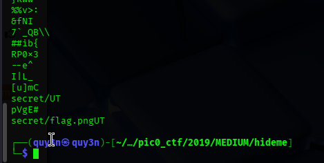
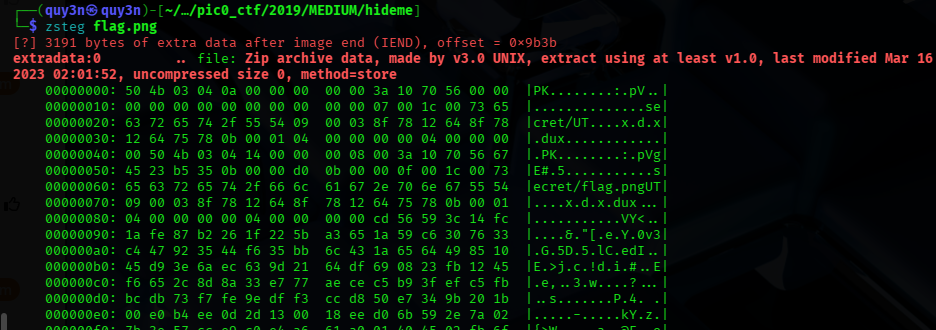

**Description:** Every file gets a flag. The SOC analyst saw one image been sent back and forth between two people. They decided to investigate and found out that there was more than what meets the eye here.

**Topic:** Forensic

First we need to download the `png` file from the problem first 

```bash
wget https://artifacts.picoctf.net/c/259/flag.png
```
Open the png file with `eog` first

```bash 
eog flag.png
```


Seem kinda normal isn't it, it tried to `strings` it to print the readable format of the file 

 

We could see that there is a weird strings that said `secrect/flag`

Then i tried to check with `zsteg`

```bash 
zsteg flag.png
```

And we actually found an folder appended within the image 

 

```bash
unzip flag.png
```

And we have the `secrect/flag.png` file 

Open it with `eog` and read the content within and we have the flag:

**Flag:** `picoCTF{Hiddinng_An_Imag3_Within_@n_Ima9e_cda72af0}`
