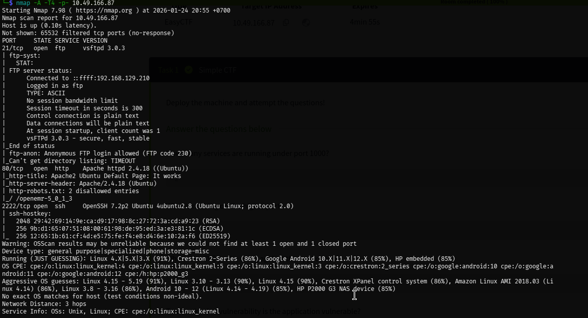
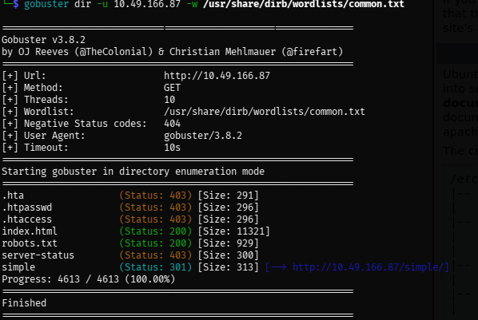
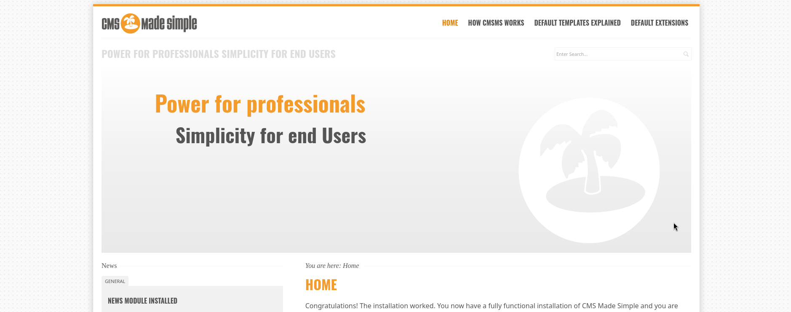
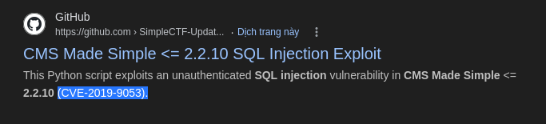

First, run the nmap scan on the target host (Scan all the open port within the target host)


```bash 
nmap -A -T4 -p- <target_ip>
```



We can easily answer: 

```markdown
***How many services are running under port 1000?*** 

-> `2`
```

Look at the **higest open port** within the image i provided, we can easily see that **ssh** was the highest one 

```markdown
***What is running on the higher port?***

-> `ssh`
```

After done active scannning the target host for open port, we next move to enumeration the current open Apache server running port 80 with `gobuster` or `dirb`

```bash 
gobuster dir -u <target_ip> -w /usr/share/dirb/wordlists/common.txt 
```
We can see the browser's directory that being hidden was `/simple`, which also leave us the hint with something related to `simple` or something...



Access the sever with `/simple` dir and we see the running page said: 



Scroll down a little with we will see the `CMS` and the version related to the current runnning server

Look it up inthe exploited database with `searchsploit`  

```bash 
searchsploit Cms 2.2.8
```
We found a exploitation that have been found called `CMS Made Simple < 2.2.10 - SQL Injection`, we can easily searchfor the CVE code within the internet and found



```markdown
***What's the CVE you're using against the application?*** 

-> `CVE-2019-9053`
```

```markdown
***To what kind of vulnerability is the application vulnerable?*** 
-> `SQLI`
```
